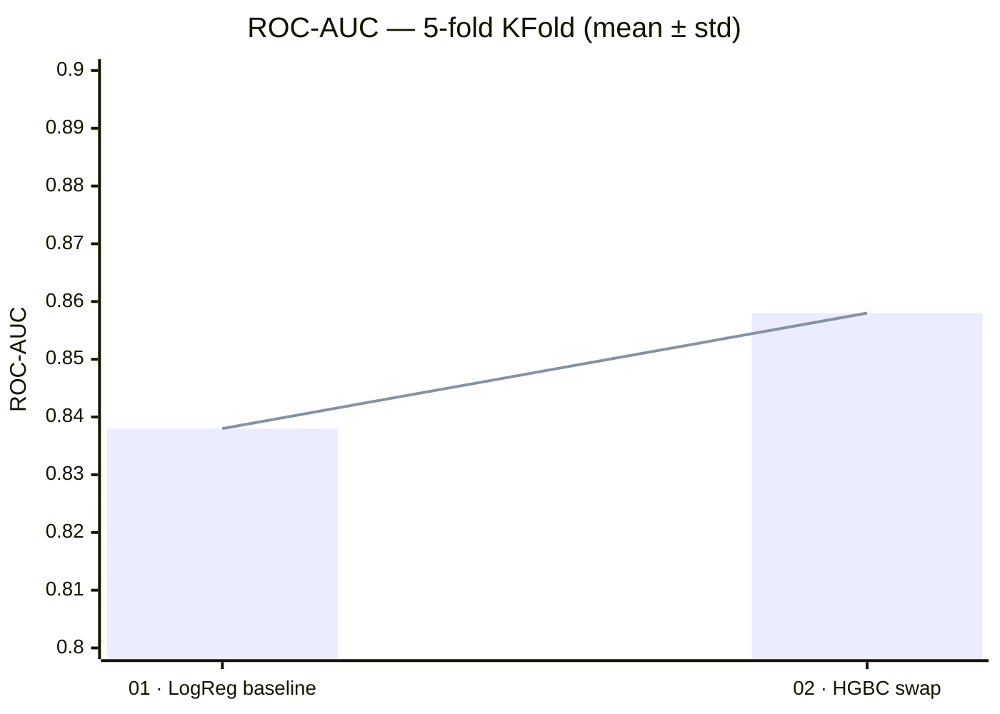
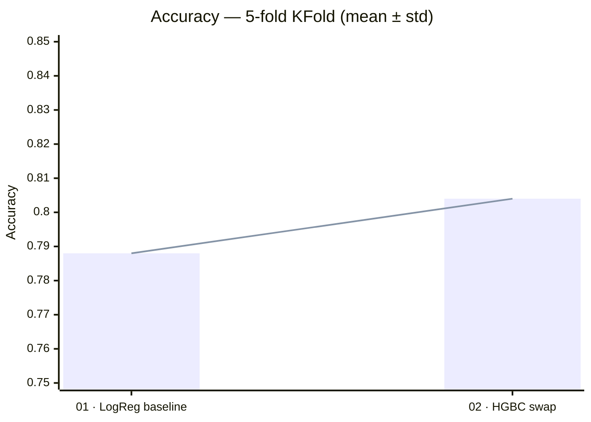
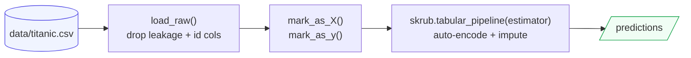

# 🚢 Titanic Survival — ML Experimentation Log

> Structured ML experimentation on the Titanic dataset, driven by the
> [Skore](https://github.com/probabl-ai/skore) agent methodology.
> Every experiment is documented, audited, and linked to its live interactive
> report on **Skore Hub**.

[](https://python.org)
[](https://github.com/astral-sh/uv)
[](https://github.com/astral-sh/ruff)
[](https://skore.probabl.ai)

---

## 📊 Dataset

| Property | Value |
|---|---|
| Source | OpenML Titanic |
| Size | 1 309 passengers × 14 columns |
| Task | Binary classification — predict `survived` |
| Target balance | ~38% survived (mild imbalance) |
| Strongest predictors | `sex` (Cramér's V 0.53), `pclass` |
| Leakage columns dropped | `boat`, `body`, `home.dest` (recorded after the outcome) |
| Baseline-only drops | `name`, `ticket`, `cabin` (near-unique; feature extraction deferred) |

---

## 🧪 Experiment results

### ROC-AUC progression



### Accuracy progression



### Full comparison table

| # | Experiment | Estimator | ROC-AUC | Accuracy | Log loss | Fit time | Skore checks | Live report |
|---|---|---|---|---|---|---|---|---|
| 01 | `baseline` | `LogisticRegression` | 0.838 ± 0.015 | 0.788 ± 0.015 | 0.466 ± 0.018 | 27 ms | ⚠️ SKD009 | [→ Hub](https://skore.probabl.ai/skore-agent-yann/titanic/cross-validations/38070) |
| 02 | `hgbc` | `HistGradientBoostingClassifier` | 0.858 ± 0.021 | 0.804 ± 0.026 | 0.479 ± 0.045 | 473 ms | 🚨 SKD001 ⚠️ SKD009 ⚠️ SKD010 | [→ Hub](https://skore.probabl.ai/skore-agent-yann/titanic/cross-validations/38084) |

> **Reading the std column:** values are across the 5 CV folds.
> Overlapping intervals between `01` and `02` mean the ROC-AUC gain is within noise —
> the model family is not the binding constraint here; the features are.

---

## 🔍 What the skore checks mean

Skore runs automated diagnostic checks after every CV run and flags issues with a code and a documentation link.

| Code | Severity | Meaning | Fires on |
|---|---|---|---|
| **SKD001** | 🚨 issue | **Potential overfitting** — significant train/test gap on a majority of metrics | `02_hgbc` |
| **SKD009** | ⚠️ issue | **Model worse than baseline** — test scores not significantly better than skore's internal HistGradientBoosting reference on 8/8 metrics | `01_baseline`, `02_hgbc` |
| **SKD010** | ⚠️ issue | **Model slower than baseline** — fit time ≈ 24× a fast linear baseline, without commensurate score gains | `02_hgbc` |

**The core insight from these two runs:** swapping the model family on noisy raw features gains ~2 pp ROC-AUC but introduces overfitting and ×17 slower fit times. The next lever is feature engineering — extracting passenger title from `name` and deck from `cabin` to give any model cleaner signal.

---

## 🗺️ Pipeline architecture



The graph is declared with **skrub DataOps** — each step is either a stateless `apply_func` or a stateful sklearn-compatible `apply`. The `mark_as_X` node is the fit/predict boundary: everything upstream runs identically at fit and predict time.

`build_learner(estimator=...)` accepts any sklearn-compatible estimator, defaulting to `LogisticRegression(max_iter=1000)`. Each experiment passes its own choice.

---

## 📁 Workspace layout

```
.
├── data/
│   ├── titanic.csv          # raw data (OpenML)
│   ├── eda.py               # EDA script (jupytext # %%)
│   └── eda.md               # EDA narrative + findings
│
├── src/titanic/
│   ├── data.py              # load_raw() — leakage-safe loader
│   ├── pipeline.py          # build_learner(estimator=) — skrub DataOps graph
│   ├── evaluate.py          # splitter — KFold(n_splits=5, shuffle=True, random_state=0)
│   └── features.py          # (reserved for feature engineering)
│
├── experiments/
│   ├── 01_baseline.py       # LogisticRegression, all defaults
│   └── 02_hgbc.py           # HistGradientBoostingClassifier, all defaults
│
├── audit/
│   ├── 01_baseline.py       # read-only report review (checks + metrics)
│   └── 02_hgbc.py
│
├── journal/
│   ├── JOURNAL.md           # experiment index (Status · History · Backlog)
│   ├── 01_baseline.md       # design note
│   └── 02_hgbc.md
│
└── tests/smoke/
    ├── test_01_baseline.py  # structural correctness: 1 prediction per row
    └── test_02_hgbc.py
```

Each experiment follows the **four-way stem pairing rule**: `journal/NN_*.md` ↔ `experiments/NN_*.py` ↔ `tests/smoke/test_NN_*.py` ↔ `audit/NN_*.py` — identical stems, one-to-one.

---

## 🚀 How to run

### Prerequisites

```bash
# install uv if needed
curl -LsSf https://astral.sh/uv/install.sh | sh

# sync the environment
uv sync --group dev
```

### Smoke tests

```bash
uv run pytest tests/smoke/ -v
```

### Run an experiment

```bash
# authenticate with Skore Hub (first time — interactive; cached afterwards)
# set SKORE_API_KEY env var to skip interactive auth

uv run python experiments/01_baseline.py
uv run python experiments/02_hgbc.py
```

Reports are pushed to **Skore Hub** and linked in the table above. The interactive UI shows per-fold metrics, calibration curves, ROC curves, and the full diagnostic check panel.

### Lint

```bash
uv run ruff check .
```

---

## 🗒️ What's next

The experiment Backlog (from `journal/JOURNAL.md`):

| # | Idea | Why |
|---|---|---|
| **B2** | Extract passenger **title** from `name` + **deck** from `cabin`, feed into logistic regression | EDA flagged these as carrying real signal (Cramér's V); the baseline deliberately discarded them. A better-featured LR may clear SKD009 without overfitting. |

---

## 📚 References

- [Skore documentation](https://docs.skore.probabl.ai)
- [Automated checks reference](https://docs.skore.probabl.ai/0.23/user_guide/automated_checks.html)
- [skrub DataOps](https://skrub-data.org/stable/data_ops.html)
- [OpenML Titanic dataset](https://www.openml.org/search?type=data&id=40945)
